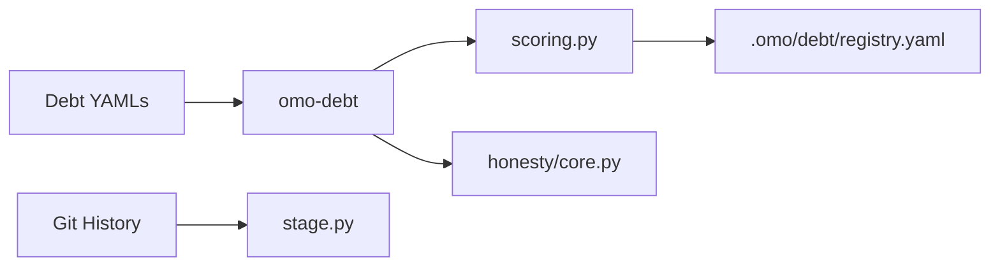

# omo-debt — Architecture

> **Layer**: L2 引擎面
> **Role**: 技术债务评分 CLI — 从 omo 拆出的债务生命周期子系统
> **Stack**: Python 3.13+, uv, click, rich, pydantic, gitpython
> **Health**: See local CI and test verification
> **SSOT**: 运行时健康、测试状态以本项目 CI、本地验证和 workspace governance SSOT 为准
>
> 系统全景参见：[`../../docs/PANORAMA.md`](../../docs/PANORAMA.md)

---

## 1. 内部架构



## 2. 入口

| Type | Entry | Port / Notes |
|:--|:--|:--|
| CLI | `omo-debt` | identify-stage/score/compare/analyze/assess-honesty |

## 3. 核心模块

| Module | Responsibility |
|:--|:--|
| `src/omo_debt/cli.py` | CLI entry |
| `src/omo_debt/core/scoring.py` | Pattern 09 v2.0 scoring |
| `src/omo_debt/core/stage.py` | Git-based stage detection |
| `src/omo_debt/honesty/core.py` | v2.1 honesty dimension |
| `src/omo_debt/models.py` | DebtItem / DebtConfig models |

## 4. 测试

```bash
cd projects/omo-debt && uv run pytest tests/ -q
```

## 架构概览

参见工作区架构概览图：[`../../docs/ARCHITECTURE-DIAGRAM.md`](../../docs/ARCHITECTURE-DIAGRAM.md)
