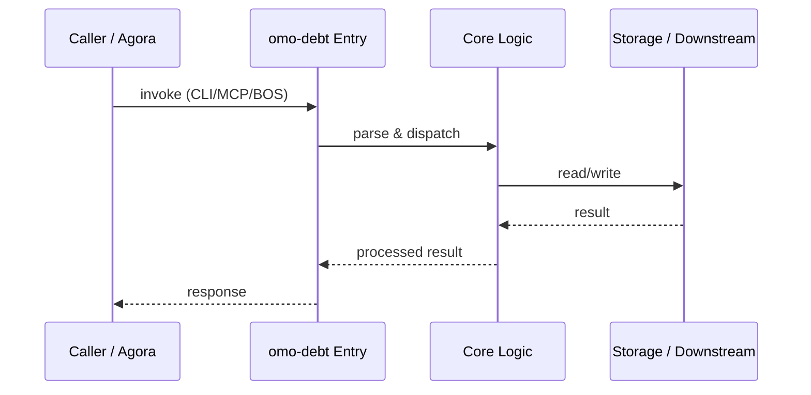

# omo-debt — Call Chain

> 本文档描述 omo-debt 内部最核心的一条调用链 / 数据流。
>
> 通用跨层调用链参见：[`docs/I0-AGORA-CALLCHAIN.md`](../docs/I0-AGORA-CALLCHAIN.md)

---

## 关键路径

1. 1. `omo-debt identify-stage <path>` analyzes git commit frequency
2. 2. `omo-debt score` computes weighted impact/frequency/cost scores
3. 3. `omo-debt compare` ranks multiple debt items
4. 4. `omo-debt assess-honesty` evaluates 4P3V1L1H dimensions
5. 5. Results output as tables or YAML for OMO registry

## Sequence Diagram

